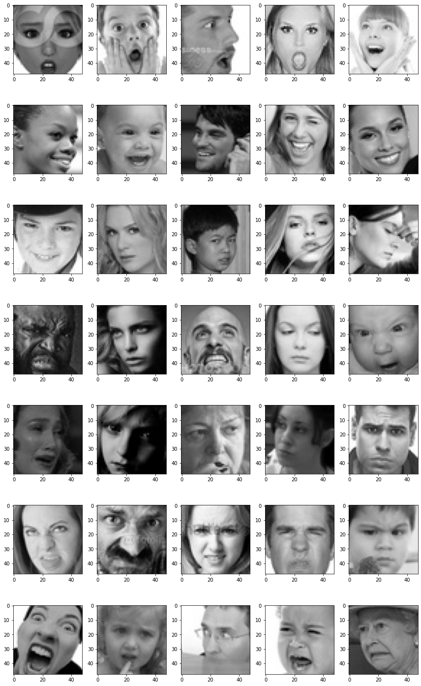

<h2 align=center> Facial Expression Recognition</h2>

 

### Task 1: Import Libraries


```python
import numpy as np
import seaborn as sns
import matplotlib.pyplot as plt
import utils
import os
%matplotlib inline

from tensorflow.keras.preprocessing.image import ImageDataGenerator
from tensorflow.keras.layers import Dense, Input, Dropout,Flatten, Conv2D
from tensorflow.keras.layers import BatchNormalization, Activation, MaxPooling2D
from tensorflow.keras.models import Model, Sequential
from tensorflow.keras.optimizers import Adam
from tensorflow.keras.callbacks import ModelCheckpoint, ReduceLROnPlateau
from tensorflow.keras.utils import plot_model

from IPython.display import SVG, Image
from livelossplot import PlotLossesKerasTF
import tensorflow as tf
print("Tensorflow version:", tf.__version__)
```

    Tensorflow version: 2.2.0
    

### Task 2: Plot Sample Images


```python
utils.datasets.fer.plot_example_images(plt).show()
```





```python
for expression in os.listdir("train/"):
    print(str(len(os.listdir("train/" + expression))) + " " + expression + " images")
```

    3171 surprise images
    7214 happy images
    4965 neutral images
    3995 angry images
    4830 sad images
    436 disgust images
    4097 fear images
    

### Task 3: Generate Training and Validation Batches


```python
img_size = 48
batch_size = 64

datagen_train = ImageDataGenerator(horizontal_flip=True)

train_generator = datagen_train.flow_from_directory("train/",
                                                    target_size=(img_size,img_size),
                                                    color_mode="grayscale",
                                                    batch_size=batch_size,
                                                    class_mode='categorical',
                                                    shuffle=True)

datagen_validation = ImageDataGenerator(horizontal_flip=True)
validation_generator = datagen_validation.flow_from_directory("test/",
                                                    target_size=(img_size,img_size),
                                                    color_mode="grayscale",
                                                    batch_size=batch_size,
                                                    class_mode='categorical',
                                                    shuffle=False)
```

    Found 28708 images belonging to 7 classes.
    Found 7178 images belonging to 7 classes.
    

 

### Task 4: Create CNN Model


```python
# Initialising the CNN
model = Sequential()

# 1 - Convolution
model.add(Conv2D(64,(3,3), padding='same', input_shape=(48, 48,1)))
model.add(BatchNormalization())
model.add(Activation('relu'))
model.add(MaxPooling2D(pool_size=(2, 2)))
model.add(Dropout(0.25))

# 2nd Convolution layer
model.add(Conv2D(128,(5,5), padding='same'))
model.add(BatchNormalization())
model.add(Activation('relu'))
model.add(MaxPooling2D(pool_size=(2, 2)))
model.add(Dropout(0.25))

# 3rd Convolution layer
model.add(Conv2D(512,(3,3), padding='same'))
model.add(BatchNormalization())
model.add(Activation('relu'))
model.add(MaxPooling2D(pool_size=(2, 2)))
model.add(Dropout(0.25))

# 4th Convolution layer
model.add(Conv2D(512,(3,3), padding='same'))
model.add(BatchNormalization())
model.add(Activation('relu'))
model.add(MaxPooling2D(pool_size=(2, 2)))
model.add(Dropout(0.25))

# Flattening
model.add(Flatten())

# Fully connected layer 1st layer
model.add(Dense(256))
model.add(BatchNormalization())
model.add(Activation('relu'))
model.add(Dropout(0.25))

# Fully connected layer 2nd layer
model.add(Dense(512))
model.add(BatchNormalization())
model.add(Activation('relu'))
model.add(Dropout(0.25))

model.add(Dense(7, activation='softmax'))

opt = Adam(lr=0.0005)
model.compile(optimizer=opt, loss='categorical_crossentropy', metrics=['accuracy'])
model.summary()
```

    Model: "sequential"
    _________________________________________________________________
    Layer (type)                 Output Shape              Param #   
    =================================================================
    conv2d (Conv2D)              (None, 48, 48, 64)        640       
    _________________________________________________________________
    batch_normalization (BatchNo (None, 48, 48, 64)        256       
    _________________________________________________________________
    activation (Activation)      (None, 48, 48, 64)        0         
    _________________________________________________________________
    max_pooling2d (MaxPooling2D) (None, 24, 24, 64)        0         
    _________________________________________________________________
    dropout (Dropout)            (None, 24, 24, 64)        0         
    _________________________________________________________________
    conv2d_1 (Conv2D)            (None, 24, 24, 128)       204928    
    _________________________________________________________________
    batch_normalization_1 (Batch (None, 24, 24, 128)       512       
    _________________________________________________________________
    activation_1 (Activation)    (None, 24, 24, 128)       0         
    _________________________________________________________________
    max_pooling2d_1 (MaxPooling2 (None, 12, 12, 128)       0         
    _________________________________________________________________
    dropout_1 (Dropout)          (None, 12, 12, 128)       0         
    _________________________________________________________________
    conv2d_2 (Conv2D)            (None, 12, 12, 512)       590336    
    _________________________________________________________________
    batch_normalization_2 (Batch (None, 12, 12, 512)       2048      
    _________________________________________________________________
    activation_2 (Activation)    (None, 12, 12, 512)       0         
    _________________________________________________________________
    max_pooling2d_2 (MaxPooling2 (None, 6, 6, 512)         0         
    _________________________________________________________________
    dropout_2 (Dropout)          (None, 6, 6, 512)         0         
    _________________________________________________________________
    conv2d_3 (Conv2D)            (None, 6, 6, 512)         2359808   
    _________________________________________________________________
    batch_normalization_3 (Batch (None, 6, 6, 512)         2048      
    _________________________________________________________________
    activation_3 (Activation)    (None, 6, 6, 512)         0         
    _________________________________________________________________
    max_pooling2d_3 (MaxPooling2 (None, 3, 3, 512)         0         
    _________________________________________________________________
    dropout_3 (Dropout)          (None, 3, 3, 512)         0         
    _________________________________________________________________
    flatten (Flatten)            (None, 4608)              0         
    _________________________________________________________________
    dense (Dense)                (None, 256)               1179904   
    _________________________________________________________________
    batch_normalization_4 (Batch (None, 256)               1024      
    _________________________________________________________________
    activation_4 (Activation)    (None, 256)               0         
    _________________________________________________________________
    dropout_4 (Dropout)          (None, 256)               0         
    _________________________________________________________________
    dense_1 (Dense)              (None, 512)               131584    
    _________________________________________________________________
    batch_normalization_5 (Batch (None, 512)               2048      
    _________________________________________________________________
    activation_5 (Activation)    (None, 512)               0         
    _________________________________________________________________
    dropout_5 (Dropout)          (None, 512)               0         
    _________________________________________________________________
    dense_2 (Dense)              (None, 7)                 3591      
    =================================================================
    Total params: 4,478,727
    Trainable params: 4,474,759
    Non-trainable params: 3,968
    _________________________________________________________________
    

 

 

### Task 6: Train and Evaluate Model


```python
%%time

epochs = 15
steps_per_epoch = train_generator.n//train_generator.batch_size
validation_steps = validation_generator.n//validation_generator.batch_size

reduce_lr = ReduceLROnPlateau(monitor='val_loss', factor=0.1,
                              patience=2, min_lr=0.00001, mode='auto')
checkpoint = ModelCheckpoint("model_weights.h5", monitor='val_accuracy',
                             save_weights_only=True, mode='max', verbose=1)
callbacks = [PlotLossesKerasTF(), checkpoint, reduce_lr]

history = model.fit(
    x=train_generator,
    steps_per_epoch=steps_per_epoch,
    epochs=epochs,
    validation_data = validation_generator,
    validation_steps = validation_steps,
    callbacks=callbacks
)
```


    accuracy
    	training         	 (min:    0.320, max:    0.667, cur:    0.667)
    	validation       	 (min:    0.408, max:    0.640, cur:    0.635)
    Loss
    	training         	 (min:    0.890, max:    1.781, cur:    0.890)
    	validation       	 (min:    0.972, max:    1.557, cur:    0.981)
    
    Epoch 00015: saving model to model_weights.h5
    448/448 [==============================] - 26s 58ms/step - loss: 0.8904 - accuracy: 0.6672 - val_loss: 0.9813 - val_accuracy: 0.6353 - lr: 5.0000e-05
    CPU times: user 6min 34s, sys: 56.7 s, total: 7min 30s
    Wall time: 6min 51s
    

 

### Task 7: Represent Model as JSON String


```python
model_json = model.to_json()
with open("model.json", "w") as json_file:
    json_file.write(model_json)
```


```python

```
